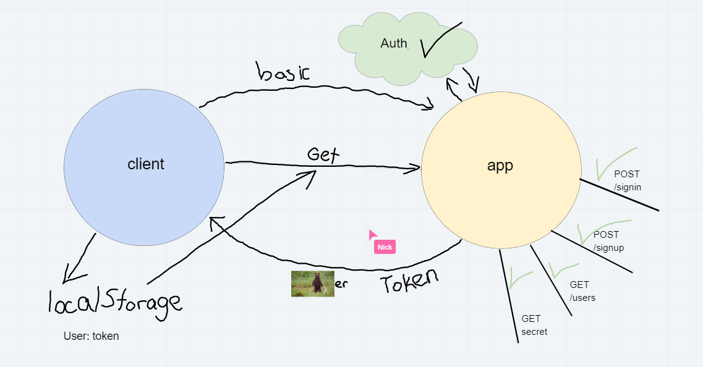

# bearer-auth
## The Setup
1. Initialize your app -- `npm init -y`
1. Install your dependencies -- `npm i dotconfig express jest`
1. Create the files and folders required for the application
1. Create the correct content in the files
1. Test your server -- `npm test`
   - You should see 100% of tests passing
1. Start your server -- `nodemon`
   - Visit <http://localhost:3000/person> in your browser to confirm that the server is visible

### Github

1. Create a new repository at GitHub, called `server-deployment-practice`
   - Select the "Add a README" option
   - Select the "Add a .gitignore" option, and choose Node.js
   - Opt for the MIT license
1. Clone this to your local machine.
1. Immediately create a "dev" branch to do your work in
   `git checkout -b dev`

## Document your work

1. Open up the README.md file in your editor. It should contain the notes your instructor provided during their demo
1. Change the URLs to point to your Heroku applications, your Github actions, and your pull request
1. Add your drawings and notes
1. ACP this to main

 ### Deployed Link
 [heroku](https://jasond-bearer-auth.herokuapp.com/)
 

### UML

### Collaborators
##### Mob Programmed by -
* Jason Quaglia
* Carly Dekock
* Nick Magruder
* Seid
* William Moreno